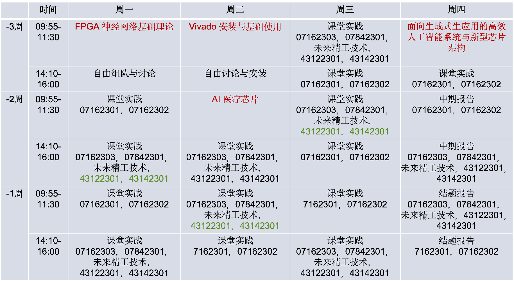

# 智能芯片与系统设计综合实践

本课程是人工智能专业必修实践环节。本课程介绍人工智能芯片的背景知识、AI芯片设计的新思路、新法与新技术，引导学生从软/硬件协同、算法和架构等不同维度去理解高效的人工智能计算，并对人工智能系统和AI芯片设计展开深度的探索与思考。本课程属于设计创新型实践课程，学生可以根据自己兴趣，结合人工智能专业需求，选择不同课题在FPGA上实现。通过此课程学生能从专业知识、科研素养、专业技能、合作与协作等方面得到提高。该课程还帮助学生掌握辩证、系统和创新等先进的思维方式，增强专业担当和社会责任感。

## 课表安排与计划

## 课程资料（我会陆续上传）
1. FPGA 神经网络开发
2. Vivado 安装与基础使用
3. 面向生成式生应用的高效人工智能系统与新型芯片架构
4. AI 医疗芯片：下一个扩展人类认知的方向

## 项目选题与考核明细
选题文档下载链接：[点击下载](https://drive.google.com/file/d/1znV2XcdvJUuQkFOkuEn_bG4JQBTuSz9z/view?usp=drive_link)

## 报告递交
1. 中期报告截止日期：2026/9/11, 23:59，[提交位置](https://drive.google.com/drive/folders/1VDabNBPR3wWhNySoT8-PQI1CHAJ5pVDB?usp=drive_link)
2. 结题报告截止日期：2026/9/18, 23:59，[提交位置](https://drive.google.com/drive/folders/1pFJx11PoTRObFnuwstsKDISJFnSOLkGc?usp=drive_link)

## 说明
如果上课来不了，请务必私信我请假条。具体格式标准好：时间、原因、姓名、班级。多谢！
